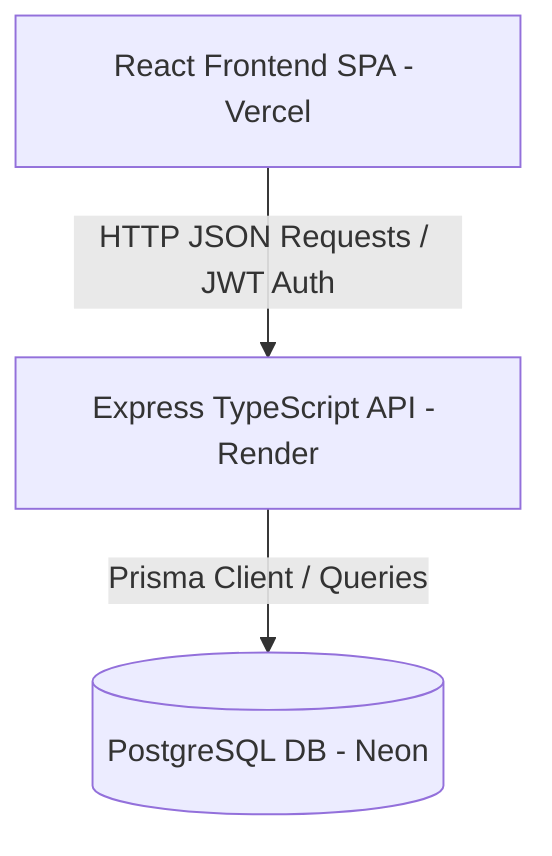
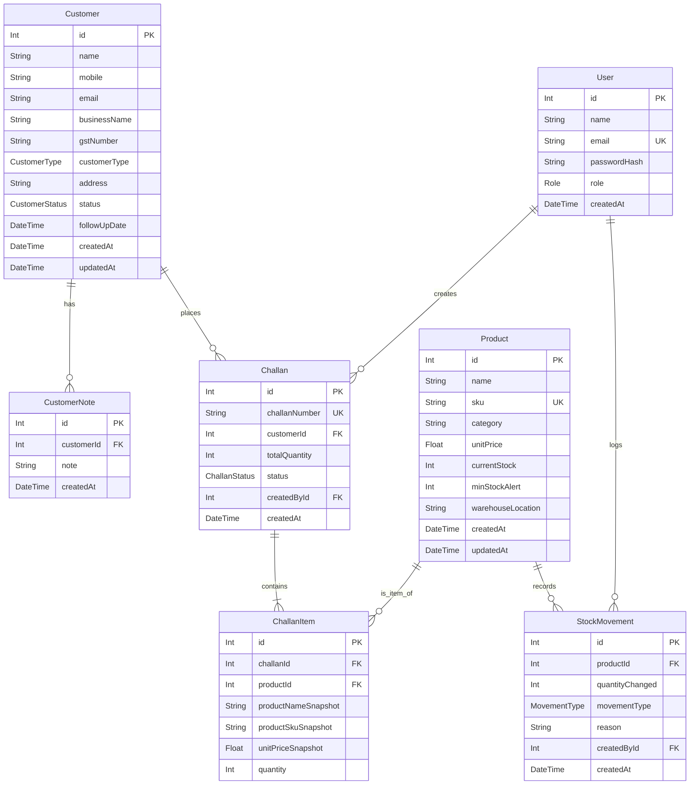

# System Architecture & Design

This document details the architectural design, folder structure, database schema, and transaction boundaries of the **Mini ERP + CRM Operations Portal**.

---

## 1. System Design Overview

The application follows a standard decoupled **Single Page Application (SPA)** and **RESTful API** architecture:



- **Frontend**: A client-side React app bundled via Vite. It uses **React Router DOM** for routing and **Axios** to communicate with the backend. User state is persisted in `localStorage`.
- **Backend**: A Node.js + Express REST API written in TypeScript. Route handlers use **Zod** to validate request bodies, and the **Prisma Client** executes queries against PostgreSQL.
- **Database**: PostgreSQL hosted on a Neon server. Relational integrity is enforced using foreign keys and unique constraints at the database level.

---

## 2. Directory Layout

The workspace is organized as a monorepo structure:

```text
mini-erp-portal/
├── backend/                  # Node.js + Express API
│   ├── prisma/               # Prisma Database configuration
│   │   ├── schema.prisma     # DB models definition
│   │   ├── seed.ts           # Demo users and sample data seed script
│   │   └── migrations/       # SQL migration history
│   └── src/
│       ├── lib/              # JWT verification middleware & Prisma initialization
│       ├── routes/           # REST endpoints (auth, customers, products, stockMovements, challans)
│       ├── server.ts         # Server entry point & sequence initializer
│       └── test_api.ts       # E2E programmatic integration tests
├── frontend/                 # React SPA (Vite)
│   ├── src/
│   │   ├── App.tsx           # React UI routing, pages, and components
│   │   ├── main.tsx          # React DOM mounting
│   │   └── styles.css        # Layout structure and styling
│   └── vercel.json           # Vercel SPA routing rewrite configurations
├── docs/                     # Architectural & Deployment Documentation
│   ├── API.md
│   ├── ARCHITECTURE.md
│   └── DEPLOYMENT.md
├── render.yaml               # Render Infrastructure blueprint configuration
└── postman_collection.json   # Full Postman verification collection
```

---

## 3. Database Entity-Relationship Diagram (ERD)

The relational schema is configured in PostgreSQL and managed via Prisma. Here is the layout of the tables and foreign keys:



---

## 4. Core Transactional Boundaries

### Challan Confirmation Flow (Atomic Reduction)
To prevent negative inventory or partial allocations, the challan confirmation executes inside a single database transaction (`prisma.$transaction`). It does the following:
1. Locks the product records.
2. Asserts that the product's `currentStock` is greater than or equal to the challan's requested `quantity`.
3. If **any** item is short on stock, the transaction immediately fails and rolls back, returning a clean `400 Bad Request` with no partial deductions.
4. If all items are available, it deducts the stock from `Product` and writes a corresponding `StockMovement` of type `OUT` for each item, before updating the `Challan` status to `CONFIRMED`.

### Challan Cancellation Flow (Restocking)
Cancelling a confirmed challan executes in a transaction to guarantee stock safety:
1. Re-updates product `currentStock` by adding back the item quantity.
2. Creates a `StockMovement` of type `IN` with reason: `Cancel challan CH-XXXX`.
3. Updates the `Challan` status to `CANCELLED`.
